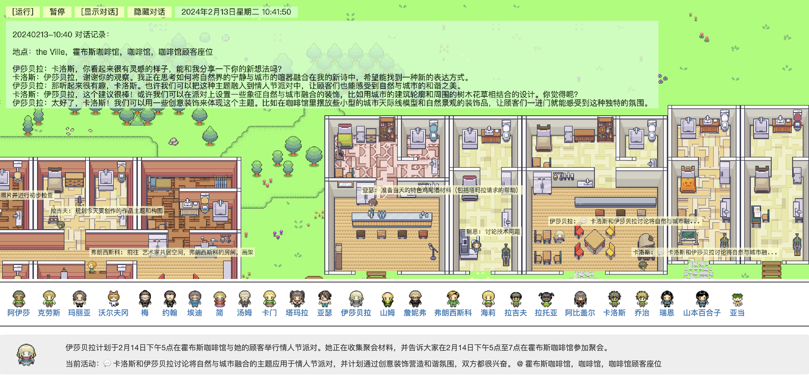
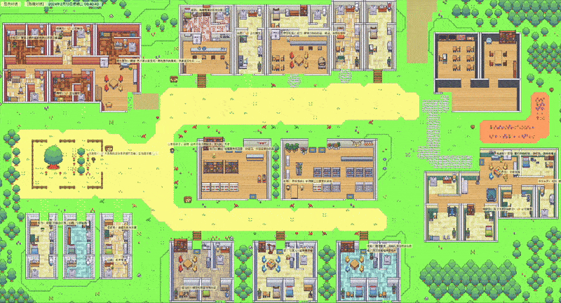
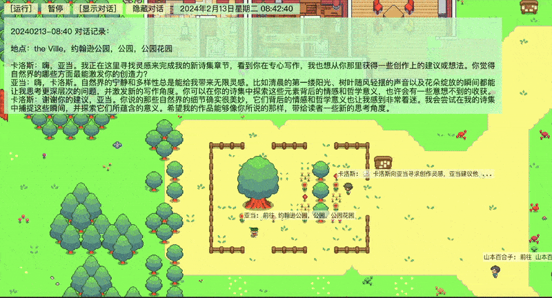
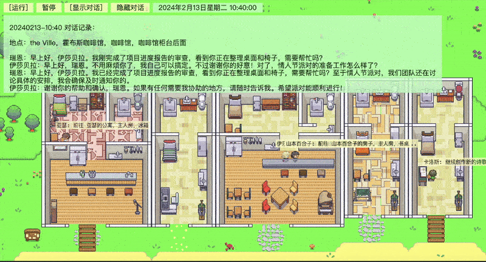
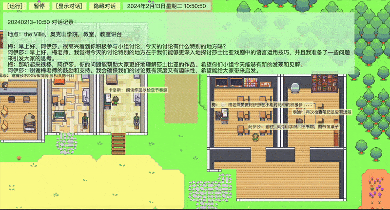

繁體中文 | [English](./README_en.md)

# 生成式智能體（Generative Agents）深度汉化版

斯坦福AI小镇由斯坦福大學和谷歌於2023年8月開源，由25個智能體组成的虚擬世界，模擬了真实的人类生活。

25個智能體完全由ChatGPT驱動，自主组织派對、參加會议、在情人節筹办各种活動。他们能够展現出與人类相似的生活模式和行為習慣。

Generative Agents的原始代码工程化程度较低，难以持續维护或拓展功能，且時隔一年多，中文LLM的能力也已胜任此类任務。因此，我们對原項目進行了重構+深度汉化，旨在為中文用户提供一個利於维护的基礎版本，以便後續实验或尝試更多玩法。

[wounderland](https://github.com/Archermmt/wounderland)項目是原[Generative Agents](https://github.com/joonspk-research/generative_agents)項目的重構版本，結構良好且代码質量远优於原版，因此本項目基於wounderland開發。

主要工作：

- 重寫全部提示語，將智能體的“母語”切換為中文，以便對接Qwen-2.5或GLM-4等中文模型；
- 針對中文特點和Qwen2.5-7b/14b模型的能力，优化中文提示語及智能體之間的對話起止逻辑；
- 所有提示語模板化，便於後期维护；
- 修正原版的小問題（例如wounderland原版中智能體在入睡後便不再醒来）；
- 增加對本地Ollama API的支持，同時將LlamaIndex embedding也接入Ollama，实現完全本地部署，降低实验成本。*Ollama安装及配置可參考[ollama.md](docs/ollama.md)*；
- 增加“斷點恢复”等特性；
- 回放界面基於原Generative Agents前端代码精簡，同時將智能體活動的時間线及對話内容保存至Markdown文檔。

回放畫面：



*注：地圖及人物名稱也同步汉化，是為了避免LLM在遇到中英混雜的上下文時，切換到英文語境。*

## 1. 準備工作

### 1.1 获取代码：

```
git clone https://github.com/x-glacier/GenerativeAgentsCN.git
cd GenerativeAgentsCN
```

### 1.2 配置大語言模型（LLM）

修改配置文件 `generative_agents/data/config.json`:
1. 默认使用[Ollama](https://ollama.com/)加載本地量化模型，並提供OpenAI兼容API。需要先拉取量化模型（參考[ollama.md](docs/ollama.md)），並确保`base_url`和`model`與Ollama中的配置一致。
2. 如果希望调用其他厂商的API，需要在`api_keys`中填入對應的key，並根據API文檔修改`base_url`和`model`。

### 1.3 安装python依赖

建议先使用anaconda3创建並激活虚擬环境：

```
conda create -n generative_agents_cn python=3.11
conda activate generative_agents_cn
```

安装依赖：

```
pip install -r requirements.txt
```

## 2. 運行虚擬小镇

```
cd generative_agents
python start.py --name sim-test --start "20240213-09:30" --step 10 --stride 10
```

參數說明:
- `name` - 每次启動虚擬小镇，需要設定唯一的名稱，用於事後回放。
- `start` - 虚擬小镇的起始時間。
- `resume` - 在運行結束或意外中斷後，從上次的“斷點”处，繼續運行虚擬小镇。
- `step` - 在迭代多少步之後停止運行。
- `stride` - 每一步迭代在虚擬小镇中對應的時間（分鐘）。假如設定`--stride 10`，虚擬小镇在迭代過程中的時間變化將會是 9:00，9:10，9:20 ...

## 3. 回放

### 3.1 生成回放數據

```
python compress.py --name <simulation-name>
```

運行結束後將在`results/compressed/<simulation-name>`目錄下生成回放數據文件`movement.json`。同時还將生成`simulation.md`，以時間线方式呈現每個智能體的狀態及對話内容。

### 3.2 启動回放服務

```
python replay.py
```

通過浏览器打開回放页面（地址：`http://127.0.0.1:5000/?name=<simulation-name>`），可以看到虚擬小镇中的居民在各個時間段的活動。

*可通過方向键移動畫面*

參數說明  
- `name` - 启動虚擬小镇時設定的名稱。
- `step` - 回放的起始步數，0代表從第一幀開始回放，预設值為0。
- `speed` - 回放速度（0-5），0最慢，5最快，预設值為2。
- `zoom` - 畫面缩放比例，预設值為0.8。

發布版本中内置了名為`example`的回放數據（由qwen2.5:32b-instruct-q4_K_M生成）。若希望以较快速度從头開始回放，畫面缩放比例為0.6，則對應的url是：
http://127.0.0.1:5000/?name=example&step=0&speed=2&zoom=0.6

也可直接打開[simulation.md](generative_agents/results/compressed/example/simulation.md)，查看`example`中所有人物活動和對話信息。

### 3.3. 回放截圖

*畫面中對話内容由qwen2.5:14b-instruct-q4_K_M生成*

小镇全景



公園



咖啡館



教室



## 4. 參考資料

### 4.1 論文

[Generative Agents: Interactive Simulacra of Human Behavior](https://arxiv.org/abs/2304.03442)

### 4.2 代码

[Generative Agents](https://github.com/joonspk-research/generative_agents)

[wounderland](https://github.com/Archermmt/wounderland)
# test1
